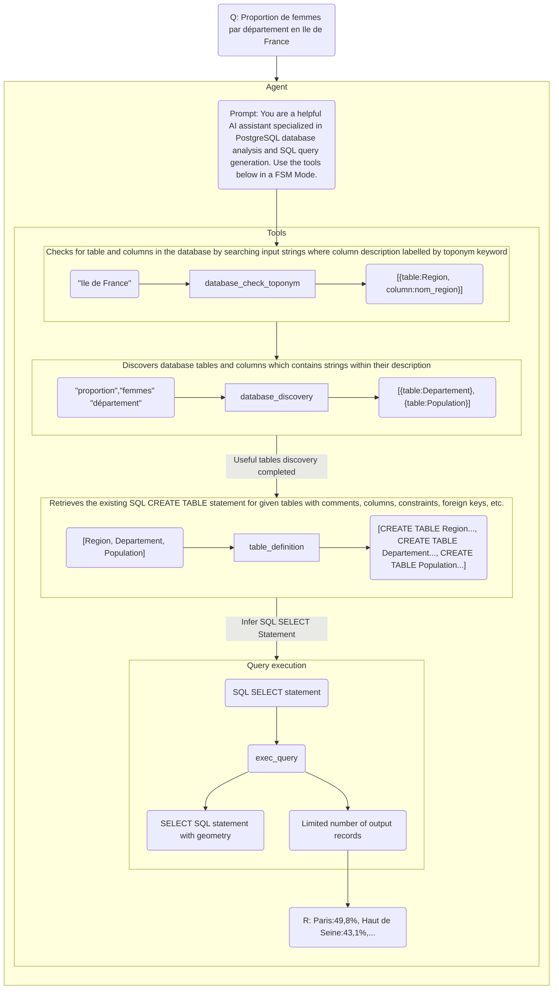

```mermaid
flowchart TD
    direction TD
    Q(Q: Proportion de femmes par département en Ile de France) --> Agent
    subgraph Agent[Agent]
        direction TD
        P(Prompt: You are a helpful AI assistant specialized in PostgreSQL database analysis and SQL query generation. Use the tools below in a FSM Mode.)   
        subgraph tool[Tools]
            direction TD
            subgraph SG[Checks for table and columns in the database by searching input strings where column description labelled by toponym keyword]
                direction LR
                AI(&quot;Ile de France&quot;) --> A
                A[database_check_toponym] --> AO(&#91&#123table:Region, column:nom_region&#125&#93)
            end
            subgraph SG1[Discovers database tables and columns which contains strings within their description]
                direction LR
                BI(&quot;proportion&quot;,&quot;femmes&quot; &quot;département&quot;) --> B
                B[database_discovery] --> BO(&#91&#123table:Departement&#125, &#123table:Population&#125&#93)
            end
            subgraph SG2[Retrieves the existing SQL CREATE TABLE statement for  given tables with comments, columns, constraints, foreign keys, etc.]
                direction LR
                CI(&#91Region, Departement, Population&#93) --> C[table_definition]
                C --> CO(&#91CREATE TABLE Region..., CREATE TABLE Departement..., CREATE TABLE Population...&#93)
            end
            subgraph SG3[Query execution]
                direction LR
                DI(SQL SELECT statement) --> D
                D(exec_query) --> DO1(SELECT SQL statement with geometry)
                 D(exec_query) --> DO2(Limited number of output records)
            end
        SG --> SG1
        SG1 --> | Useful tables discovery completed | SG2
        SG2 --> | Infer SQL SELECT Statement | SG3
        DO2 --> R(R: Paris:49,8%, Haut de Seine:43,1%,...)
        end
        P --> SG
    end
```

