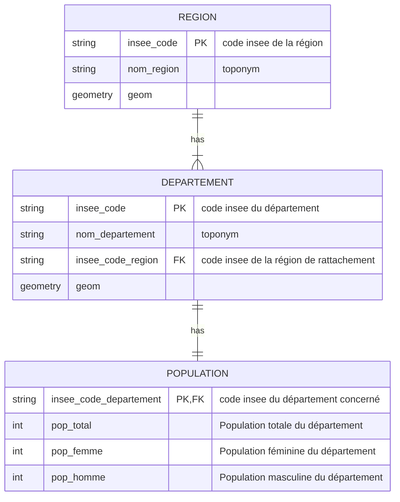
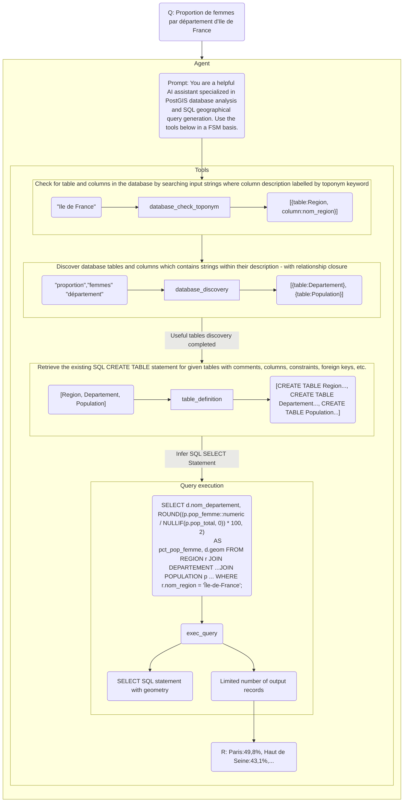

# Geographical data discovery & mapping

## Data Model

```mermaid
erDiagram
    %% regions administratives
    REGION {
        string insee_code PK "code insee de la région"
        string nom_region "toponym"
        geometry geom
    }

    %% départements administratifs
    DEPARTEMENT {
        string insee_code PK "code insee du département"
        string nom_departement "toponym"
        string insee_code_region FK "code insee de la région de rattachement"
        geometry geom
    }

    %% population par département
    POPULATION {
        string insee_code_departement PK, FK "code insee du département concerné"
        int pop_total "Population totale du département"
        int pop_femme "Population féminine du département"
        int pop_homme "Population masculine du département"
    }

    REGION ||--|{ DEPARTEMENT : has
    DEPARTEMENT ||--|| POPULATION : has

```

## Agent Workflow (first step)

```mermaid
flowchart TD
    direction TD
    Q(Q: Proportion de femmes par département d'Ile de France) --> Agent
    subgraph Agent[Agent]
        direction TD
        P(Prompt: You are a helpful AI assistant specialized in PostGIS database analysis and SQL geographical query generation. Use the tools below in a FSM basis.)   
        subgraph tool[Tools]
            direction TD
            subgraph SG[Check for table and columns in the database by searching input strings where column description labelled by toponym keyword]
                direction LR
                AI(&quot;Ile de France&quot;) --> A
                A[database_check_toponym] --> AO(&#91&#123table:Region, column:nom_region&#125&#93)
            end
            subgraph SG1[Discover database tables and columns which contains strings within their description - with relationship closure]
                direction LR
                BI(&quot;proportion&quot;,&quot;femmes&quot; &quot;département&quot;) --> B
                B[database_discovery] --> BO(&#91&#123table:Departement&#125, &#123table:Population&#125&#93)
            end
            subgraph SG2[Retrieve the existing SQL CREATE TABLE statement for given tables with comments, columns, constraints, foreign keys, etc.]
                direction LR
                CI(&#91Region, Departement, Population&#93) --> C[table_definition]
                C --> CO(&#91CREATE TABLE Region..., CREATE TABLE Departement..., CREATE TABLE Population...&#93)
            end
            subgraph SG3[Query execution]
                direction LR
                DI(SELECT d.nom_departement, ROUND#40;#40;p.pop_femme::numeric / NULLIF#40;p.pop_total, 0#41;#41; * 100, 2#41;
                    AS pct_pop_femme, d.geom FROM REGION r JOIN DEPARTEMENT ...JOIN POPULATION p ... WHERE r.nom_region = 'Île-de-France'; ) --> D
                D(exec_query) --> DO1(SELECT SQL statement with geometry)
                 D(exec_query) --> DO2(Limited number of output records)
            end
        SG --> SG1
        SG1 --> | Useful tables discovery completed | SG2
        SG2 --> | Infer SQL SELECT Statement | SG3
        DO2 --> R(R: Paris:49,8%, Haut de Seine:43,1%,...)
        end
        P --> SG
    end
```

## Agent workflow (second step)