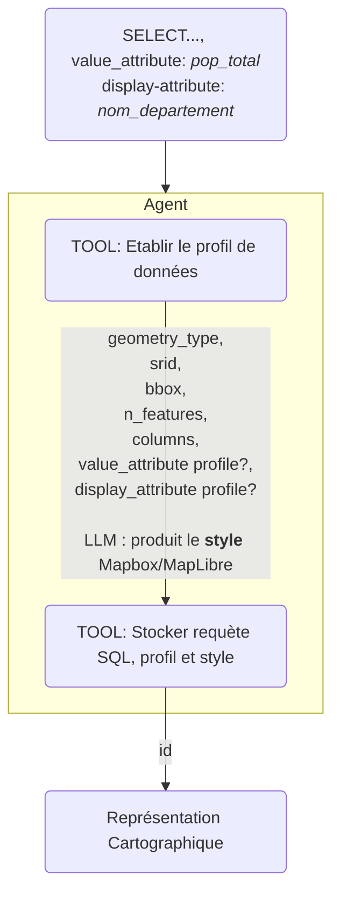
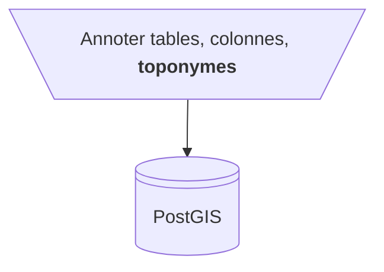
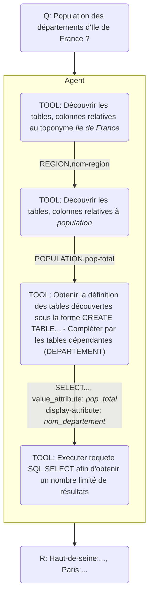
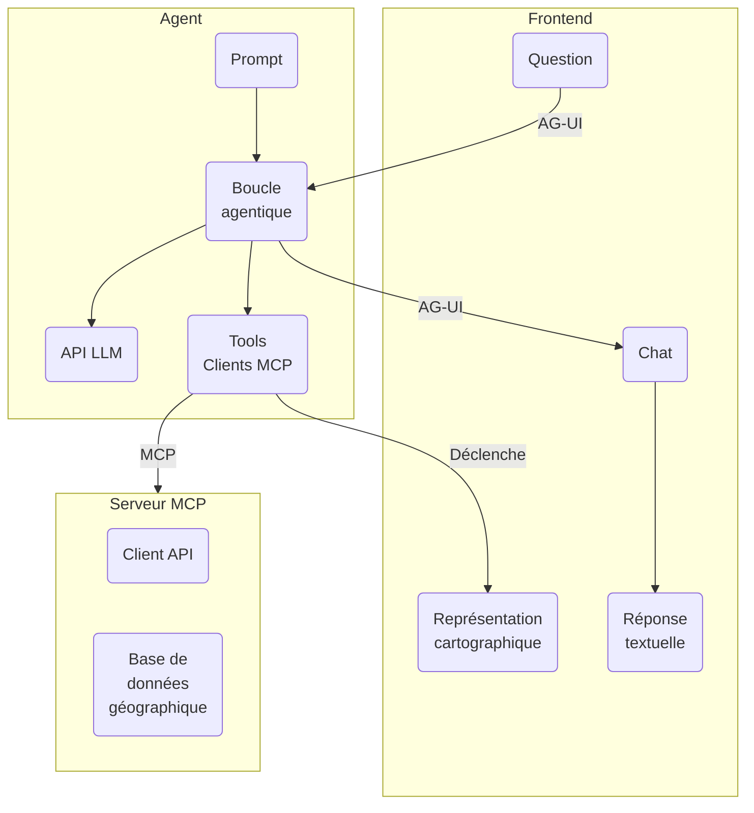

```mermaid
flowchart TB
    QUESTION(SELECT..., <br/>value_attribute: <i>pop_total</i><br/>display-attribute: <i>nom_departement</i>)
    subgraph AGENT[Agent]
    direction TB
        T1("TOOL: Etablir le profil de données")
        T2("TOOL: Stocker requète SQL, profil et style")

        T1 --> |geometry_type,<br>srid,<br>bbox,<br>n_features,<br>columns,<br>value_attribute profile?,<br>display_attribute profile?</br></br>LLM : produit le <b>style</b> Mapbox/MapLibre | T2
    end
    CARTE(Représentation Cartographique)
    QUESTION --> AGENT
    T2 --> | id | CARTE
```

```mermaid
flowchart TB

        A@{ shape: trap-t, label: "Annoter tables, colonnes, <b>toponymes<b/>" }
        DATABASE@{ shape: lin-cyl, label: "PostGIS" }
        A --> DATABASE

```

```mermaid
flowchart TB

    QUESTION("Q: Population des départements d'Ile de France ?")
    QUESTION --> AGENT
    RESPONSE("R: Haut-de-seine:..., Paris:...")

    subgraph AGENT[Agent]
    direction TB
        T1("TOOL: Découvrir les tables, colonnes relatives au toponyme <i>Ile de France</i>")
        T2("TOOL: Decouvrir les tables, colonnes relatives à <i>population</i>")
        T3("TOOL: Obtenir la définition des tables découvertes sous la forme CREATE TABLE... - Compléter par les tables dépendantes (DEPARTEMENT)")
        T4("TOOL: Executer requete SQL SELECT afin d'obtenir un nombre limité de résultats")
        T1 --> | REGION,nom-region | T2
        T2 --> | POPULATION,pop-total | T3
        T3 --> | SELECT..., <br/>value_attribute: <i>pop_total</i><br/>display-attribute: <i>nom_departement</i> |T4
    end

    AGENT --> RESPONSE
```

```mermaid
flowchart TB
    
    subgraph AGENT[Agent]
        PROMPT(Prompt)
        PROMPT --> LOOP
        LOOP(Boucle<br>agentique)
        LLM(API LLM)
        TOOLS(Tools<br/>Clients MCP)
        LOOP --> TOOLS
        LOOP --> LLM
    end
    subgraph FRONTEND[Frontend]
        direction TB
        Q(Question)
        MAP(Représentation<br/>cartographique)
        CHAT(Chat)
        R(Réponse<br/>textuelle)
        CHAT--> R
    end
    subgraph SERVER[Serveur MCP]
        API(Client API)
        DATABASE(Base de<br/>données<br/>géographique)
    end
    Q --> | AG-UI | LOOP
    TOOLS--> | MCP | SERVER
    LOOP --> | AG-UI | CHAT
    TOOLS --> | Déclenche | MAP
    
```